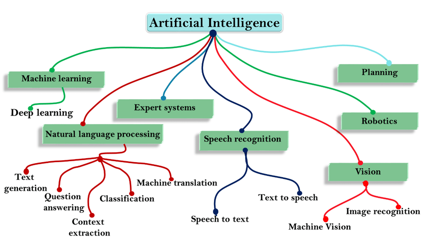

# Redes Neurais Artificiais Algoritmos poderosos para aplicações de IA e
ML

# Introdução

A inteligência artificial – IA (artificial intelligence – AI), segundo a
Encyclopædia Britannica, é uma disciplina da ciência da computação que
pesquisa a capacidade de um recurso computacional executar tarefas
comumente associadas a seres inteligentes. O termo é amplo e geralmente
aplicado ao desenvolvimento de sistemas e processos com capacidade de
raciocinar, classificar, descobrir significado, generalizar ou aprender
com experiências passadas CiteDrive (2022). A Inteligência Artificial
pode ser dividida em 7 subcampos, conforme **?@fig-figura1** Kayid
(2020):

- Aprendizado de máquina (machine learning – ML), Mineração de Dados e
  Grandes Dados (Data Mining e Big Data);
- Planejamento Automatizado; 
  

As redes neurais artificiais – RNAs (artificial neural networks – ANN)
são técnicas computacionais que apresentam um modelo matemático
inspirado na estrutura neural de organismos inteligentes e que adquirem
conhecimento através da experiência \[4\]. Essa estrutura é formada por
neurônios artificiais, funções de ativação específicas, conforme
apresentado em \[5\]. As RNAs desempenham papel fundamental nos
algoritmos de ML e IA.

# 2. TIPOS DE REDES NEURAIS ARTIFICIAIS

O aumento do poder computacional das últimas décadas permitiu uma rápida
evolução e proposição de diferentes arquiteturas de RNAs para as mais
variadas áreas do conhecimento humano \[5\]. A Figura 3 fornece uma
ideia da variedade de configurações de RNAs \[6\]. Neste post serão
apresentados as RNAs mais comumente empregadas em aplicações de ML.

## 2.1 Rede Neural Feedforward

A RNA do tipo feedforward foi uma das primeiras propostas, sendo uma das
mais básicas. Nesta RNA, os dados ou a entrada fornecida viajam em uma
única direção (forward). Os dados entram na RNA pela camada de entrada
(input layer) e saem pela camada de saída (output layer), enquanto
camadas ocultas (hidden layer) podem ou não existir. Logo, a rede neural
feedforward (FNN) possui apenas uma onda propagada frontalmente sendo
geralmente treinadas utilizando-se o método de retropropagação. Podem
ser usadas para aproximação de funções e classificação de padrões \[6\].

A rede neural de função base radial (radial basis function neural
network – RBFNN) é um tipo de RNA feedforward que faz uso de funções de
base radial como funções de ativação nos neurônios da camada oculta. Uma
função de base radial é uma função de valor real, cujo valor depende
apenas da distância da origem. Embora existam vários tipos de funções de
base radial, a função Gaussiana é a mais frequentemente empregada,
conforme Eq. 1, a seguir.

$$
h_j(x) = \exp\left(-\frac{\|x - c_j\|^2}{\sigma_j^2}\right)    (1)
$$

CiteDrive, Inc. 2022. “CiteDrive Brings Reference Management to
Overleaf.” 2022. <https://www.citedrive.com/overleaf>.

Kayid, Amr. 2020. “The Role of Artificial Intelligence in Future
Technology.” *Department of Computer Science, The German University in
Cairo*.

